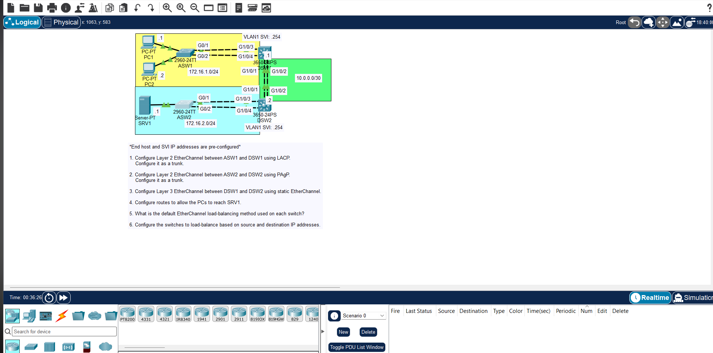

# JEREMY IT LAB DAY 23 LAB: ETHERCHANNEL



---

## LAB OVERVIEW

In this lab, you build logical aggregate links (EtherChannels/Port-Channels) between switches using multiple physical links.

By grouping individual cables into a single logical link, you increase total aggregate bandwidth and provide link redundancy. If one cable in the bundle fails, traffic instantly shifts to the remaining cables without triggering Spanning Tree re-convergence.

---

## IMPORTANT POINTS TO REMEMBER

### 1. Mandatory Parameter Match

All physical ports inside an EtherChannel **must match identical settings** before being bundled. A mismatch in any of these will cause the port to be suspended (`s` state):

- Port Speed and Duplex
- Switchport Mode (Access vs. Trunk)
- Native VLAN and Allowed VLAN list (if trunking)
- STP Port Costs and Settings

### 2. Configure the Logical Interface

Always apply trunking or VLAN changes to the **`interface port-channel X`** rather than individual physical ports once the channel group is formed. The logical interface automatically pushes those configurations down to member ports.

### 3. Mode Matching Matrix (Will it form?)

| Protocol   | Local Mode  | Remote Mode | EtherChannel Status          |
| :--------- | :---------- | :---------- | :--------------------------- |
| **Static** | `on`        | `on`        | **UP**                       |
| **LACP**   | `active`    | `active`    | **UP**                       |
| **LACP**   | `active`    | `passive`   | **UP**                       |
| **LACP**   | `passive`   | `passive`   | **DOWN** (Neither initiates) |
| **PAgP**   | `desirable` | `desirable` | **UP**                       |
| **PAgP**   | `desirable` | `auto`      | **UP**                       |
| **PAgP**   | `auto`      | `auto`      | **DOWN** (Neither initiates) |

> **Warning:** Never pair `mode on` with `active`, `passive`, `desirable`, or `auto`. `mode on` does not use a negotiation protocol and will cause loop issues or port errors if mismatched.

### 4. Protocol Maximums & Limits

- **LACP (802.3ad):** Supports up to **16 ports** (8 active, 8 hot-standby).
- **PAgP (Cisco):** Supports up to **8 active ports**.

### 5. Critical Verification Commands

- `show etherchannel summary` — Look for the status flags: **`SU`** (Layer 2, In Use) and **`P`** (Bundled in Port-Channel).
- `show interfaces port-channel X` — Verifies total combined bandwidth (e.g., $2 \times 1\text{ Gbps} = 2\text{ Gbps}$).
- `show etherchannel load-balance` — Checks how traffic is distributed across links (Source MAC, Destination MAC, or IP-based hashing).

```

```
