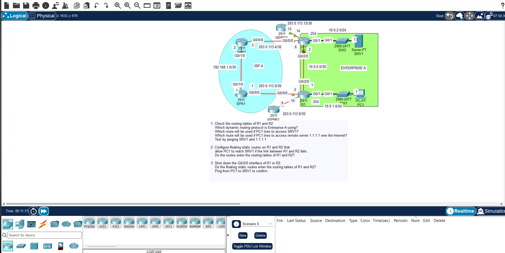

# JEREMY IT LAB Day 24: Floating Static Routes

## Objective

Configure a primary static route and a floating backup static route so traffic automatically fails over when the primary path goes down.

## Topology

- Primary path: R1 → R2 → R4
- Backup path: R1 → R3 → R4

## Important Notes

- A floating static route is a backup route with a **higher Administrative Distance (AD)** than the primary route.
- Default AD: Connected = 0, Static = 1, eBGP = 20, EIGRP = 90, OSPF = 110, RIP = 120.
- The floating route stays out of the routing table while the primary is up. It only appears when the primary fails.
- To make a static route float, add the AD value at the end of the command:
