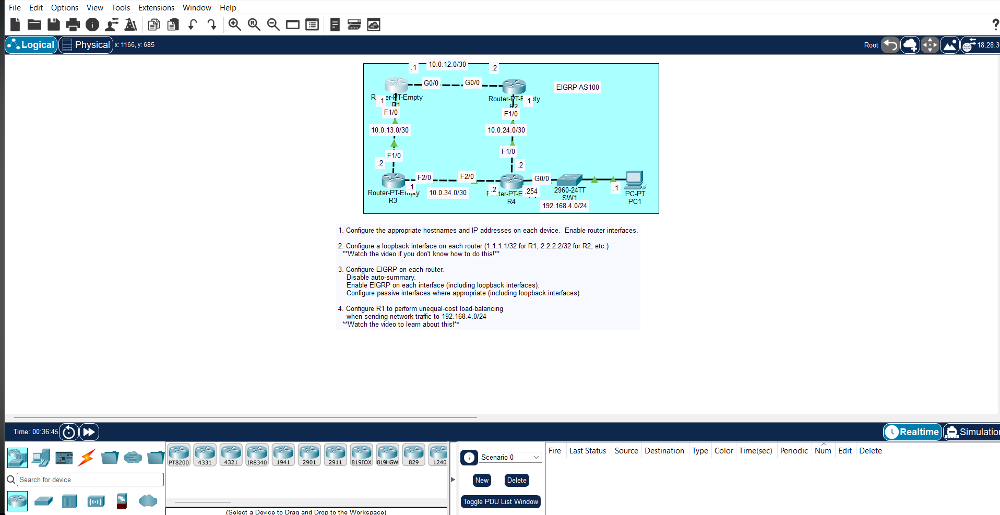

## JEREMY IT LAB DAY 25 LAB : EIGRP CONFIGURATION

## Objective

Configure EIGRP AS 100 on a 4-router topology with classless routing, passive interfaces, and unequal-cost load balancing.

## Topology

- R1-R2: 10.0.12.0/30
- R1-R3: 10.0.13.0/30
- R2-R4: 10.0.24.0/30
- R3-R4: 10.0.34.0/30
- R4 LAN: 192.168.4.0/24

Loopbacks: 1.1.1.1/32, 2.2.2.2/32, 3.3.3.3/32, 4.4.4.4/32

## Tasks

### 1. IP Addressing

Configure interfaces and loopbacks on all four routers. Use /30 subnets for point-to-point links.

### 2. EIGRP AS 100

On every router:

router eigrp 100
no auto-summary
network <connected networks with wildcard masks>
passive-interface loopback0

On R4, also make the LAN interface passive:

passive-interface g0/0

Wildcard mask for /30 is 0.0.0.3, for /24 it's 0.0.0.255.

### 3. Unequal-Cost Load Balancing

On R1, set variance to allow both paths to 192.168.4.0/24:

router eigrp 100
variance 2

## Important Notes

- AS number must match on all routers.
- `no auto-summary` is required for classless behavior.
- Passive interfaces stop EIGRP updates on interfaces with no neighbors.
- Variance enables unequal-cost load balancing, but only for routes that meet the feasibility condition (RD < FD).

## Verification

show ip eigrp neighbors
show ip eigrp topology
show ip route
show ip protocols
