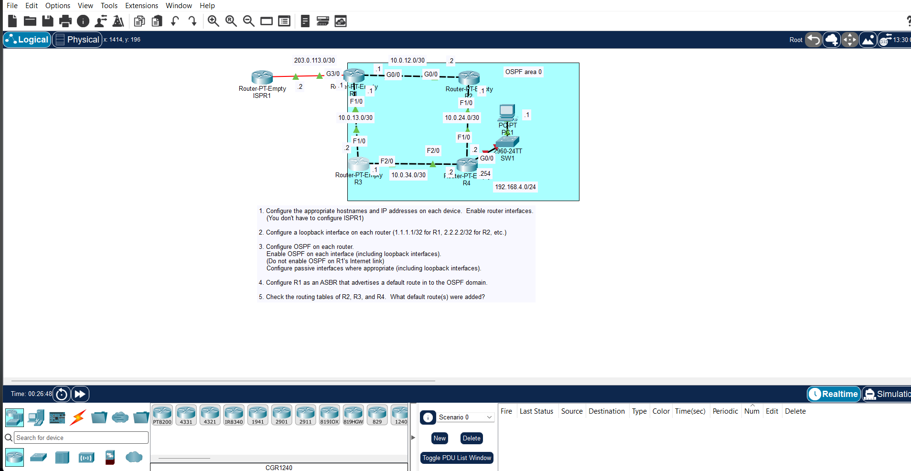

# JEREMY IT LAB Day 26: OSPF (Part 1)

## Objective

Configure single-area OSPF on a multi-router topology. Enable OSPF on all routers, set router IDs, configure passive interfaces, and verify neighbor adjacencies and routing tables.

## Topology



## Important Notes

- OSPF process ID is locally significant. It does not have to match between neighbors.
- Router ID selection priority: 1) Manual configuration 2) Highest IP on a loopback 3) Highest IP on a physical interface.
- Use `router-id` to set the router ID manually. A loopback is recommended for stability.
- `network <ip> <wildcard> area <area>` enables OSPF on interfaces within that range.
- Wildcard mask is the inverse of the subnet mask. /24 = 0.0.0.255, /30 = 0.0.0.3.
- Single-area OSPF does not have to use area 0, but it is best practice.
- Passive interfaces stop OSPF hellos on interfaces with no neighbors. Loopbacks should always be passive.
- `default-information originate` advertises a default route into OSPF.
- `maximum-paths <n>` changes the max ECMP paths.
- `distance <value>` changes OSPF administrative distance.

## Verification

show ip ospf neighbor
show ip ospf database
show ip ospf interface brief
show ip route
show ip protocols

```
Check that neighbors reach FULL state, LSAs are exchanged, and OSPF routes appear in the routing table.
```
