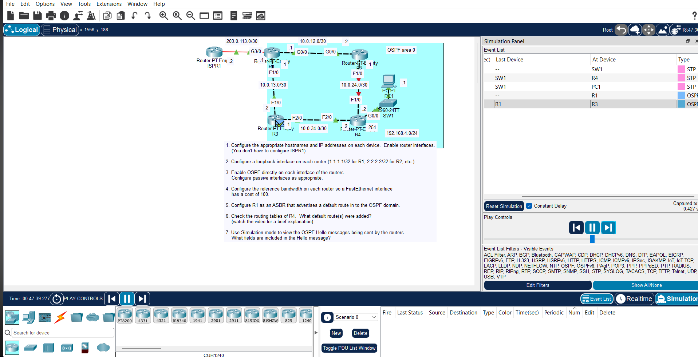

# JEREMY IT LAB Day 27: OSPF Part 2

## Overview

Second OSPF lab covering reference bandwidth, passive interfaces, and default route injection. R1 connects to an ISP and acts as the ASBR, injecting a default route into OSPF for the internal routers.

## Topology

Four routers in a partial mesh. R1 connects to an external ISP link (203.0.113.0/30). PC1 sits behind R4 on 192.168.4.0/24. Loopbacks 1.1.1.1–4.4.4.4 used for router IDs.

## Important Points

- **Reference bandwidth**: Default is 100 Mbps, so FastEthernet and Gigabit both get cost 1. Set `auto-cost reference-bandwidth 1000` to differentiate them (FastEthernet = 10, Gigabit = 1).
- **`bandwidth` vs `speed`**: `bandwidth` only changes the OSPF metric. `speed` changes the actual interface speed. Don't mix them up.
- **Passive interfaces**: Use `passive-interface default` then `no passive-interface <int>` on links facing neighbors. Cleaner than listing every passive interface manually.
- **ASBR**: R1 is the ASBR because it connects to the external network. It needs a static default route and `default-information originate` to share it with the OSPF domain.
- **Default route type**: Injected as **O\*E2** by default, meaning external type 2 — cost stays the same across the domain.
- **Neighbor states**: Down → Init → 2-Way → Exstart → Exchange → Loading → Full. Stuck at Exstart usually means MTU mismatch.

## Key Commands

router ospf 1
auto-cost reference-bandwidth 1000
passive-interface default
no passive-interface g0/0
default-information originate

ip route 0.0.0.0 0.0.0.0 203.0.113.2

## Verification

show ip ospf neighbor
show ip ospf interface brief
show ip ospf database
show ip route ospf
show ip protocols

Check for Full adjacencies, cost values matching the reference bandwidth, passive interfaces marked in `show ip protocols`, and `O*E2 0.0.0.0/0` in R2/R3/R4 routing tables.
