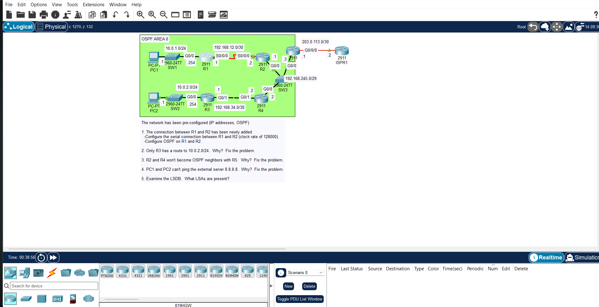

# JEREMY IT LAB DAY 28 LAB : OSPF 3

## Overview

Third OSPF lab. Covers OSPF network types, DR/BDR election, and neighbor adjacency troubleshooting on a broadcast network segment.

## Topology

A shared broadcast segment connects multiple OSPF routers, forcing a DR/BDR election. Other links use point-to-point network types.

## Important Points

- **OSPF network types**: Broadcast (default on Ethernet), Point-to-Point, Non-Broadcast, Point-to-Multipoint. Ethernet defaults to broadcast.
- **DR/BDR election**: Only on broadcast and non-broadcast networks. Winner is highest OSPF priority, then highest Router ID as tiebreaker. Priority 0 means the router can never become DR.
- **DROther routers**: All non-DR/BDR routers form Full adjacencies only with the DR and BDR. They stay in 2-Way with each other.
- **Multicast addresses**: 224.0.0.5 for AllSPFRouters, 224.0.0.6 for AllDRouters.
- **Timers must match**: Hello and Dead intervals must match between neighbors, or adjacency won't form. Default on broadcast is Hello 10s / Dead 40s. On point-to-point it's Hello 10s / Dead 40s as well, but on NBMA it's Hello 30s / Dead 120s.
- **`ip ospf network point-to-point`**: Common fix on links that connect exactly two routers. Skips DR/BDR election entirely, faster convergence.
- **MTU mismatch**: Causes neighbors to get stuck in Exstart/Exchange state. Fix with `ip mtu` on both ends or `ip ospf mtu-ignore`.
- **Passive interfaces**: Same rule as prior labs. Loopbacks and non-OSPF interfaces should be passive.

## Key Commands

router ospf 1
network 10.0.0.0 0.0.0.255 area 0
passive-interface default
no passive-interface g0/0

interface g0/0
ip ospf network point-to-point
ip ospf priority 0
ip ospf hello-interval 10
ip ospf dead-interval 40
ip ospf cost 10
ip ospf mtu-ignore

## Verification

show ip ospf neighbor
show ip ospf interface g0/0
show ip ospf database
show ip route ospf
show ip protocols

Check:

- DR and BDR are elected on broadcast segments, DROthers stay in 2-Way with each other.
- Neighbors reach Full with DR and BDR.
- Timers match between neighbors.
- No stuck Exstart/Exchange states (MTU issue).
- OSPF routes appear in the routing table.
