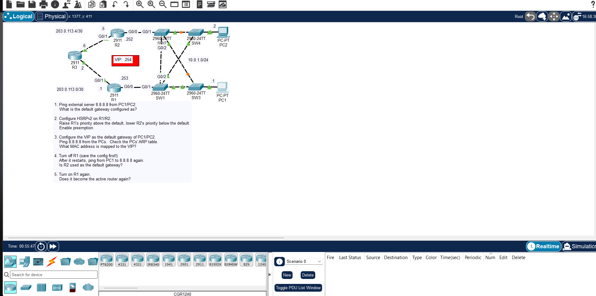

# JEREMY IT LAB DAY 29 : HSRP CONFIGURATION

## Overview

First Hop Redundancy Protocol lab using HSRP. Two routers share a virtual IP that hosts use as their default gateway. One router is Active, the other is Standby. If the Active fails, the Standby takes over.

## Topology

Two routers connected to a shared LAN segment with hosts. Each router has its own physical IP on the LAN, plus a shared virtual IP that hosts point to as their gateway.

## Important Points

- **HSRP is Cisco-proprietary**. VRRP is the standards-based equivalent. GLBP is another Cisco option that adds load balancing.
- **Active/Standby model**: Only one router forwards traffic at a time. The Standby is idle until failover. This wastes bandwidth if you have two links, which is why MHSRP (two groups with different priorities) is used for load sharing.
- **Virtual MAC address**: `0000.0C07.ACxx` where `xx` is the group number in hex (HSRPv1). HSRPv2 uses `0000.0C9F.Fxxx`.
- **Priority and preemption**: Higher priority wins. Default is 100. Preemption must be explicitly enabled with `standby preempt` — without it, a router that comes back online will not reclaim the Active role even if it has higher priority.
- **Version differences**: HSRPv1 uses multicast `224.0.0.2` and supports group numbers 0–255. HSRPv2 uses `224.0.0.102` and supports 0–4095. Version 1 is the default.
- **Object tracking**: HSRP can track an interface or route. If the tracked object goes down, the HSRP priority is decremented, triggering failover. Default decrement is 10.
- **Timers**: Hello timer default is 3 seconds, hold timer is 10 seconds.

## Key Commands

interface g0/0
ip address 10.0.0.2 255.255.255.0
standby 1 ip 10.0.0.1
standby 1 priority 150
standby 1 preempt
standby 1 track 1 decrement 30
standby version 2
standby 1 timers 3 10

## Verification

show standby
show standby brief
show standby g0/0

Check:

- Local state is Active on one router and Standby on the other.
- Virtual IP is configured and matches on both routers.
- Priority values match your design.
- Preempt is enabled where it should be.
- After shutting down the Active router's interface, the Standby becomes Active within the hold timer window.
