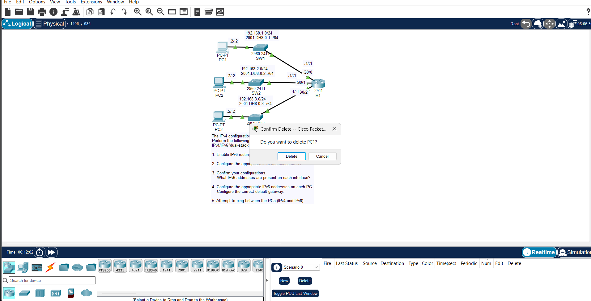

# Day 31: Configuring IPv6 (Part 1)

## Overview

First IPv6 configuration lab. Covers address notation, shortening/expanding addresses, and basic interface configuration on Cisco routers in a dual-stack environment.

## Topology

## Important Points

- IPv6 addresses are 128 bits, written as 8 quartets of 4 hex digits separated by colons.
- Shortening rules: strip leading zeros in each quartet; replace consecutive all-zero quartets with `::` (only once per address).
- Enterprises typically get a `/48` block from their ISP; subnets inside use `/64`.
- AFRINIC manages IP address allocation in Africa.
- `ipv6 unicast-routing` must be enabled globally on the router, or IPv6 traffic won't be forwarded between interfaces.
- `ipv6 enable` gives an interface a link-local address only.
- `ipv6 address` assigns a global unicast address.

## Key Commands

R1(config)# ipv6 unicast-routing

R1(config-if)# ipv6 address 2001:DB8:0:1::1/64
R1(config-if)# ipv6 enable

## Verification

show ipv6 interface brief
show ipv6 route
show ipv6 neighbors
show ipv6 protocols

Check:

- Global unicast addresses on each configured interface
- Link-local addresses auto-generated (FE80::/10)
- Connected and local routes for IPv6 prefixes in the routing table
- IPv6 routing enabled
